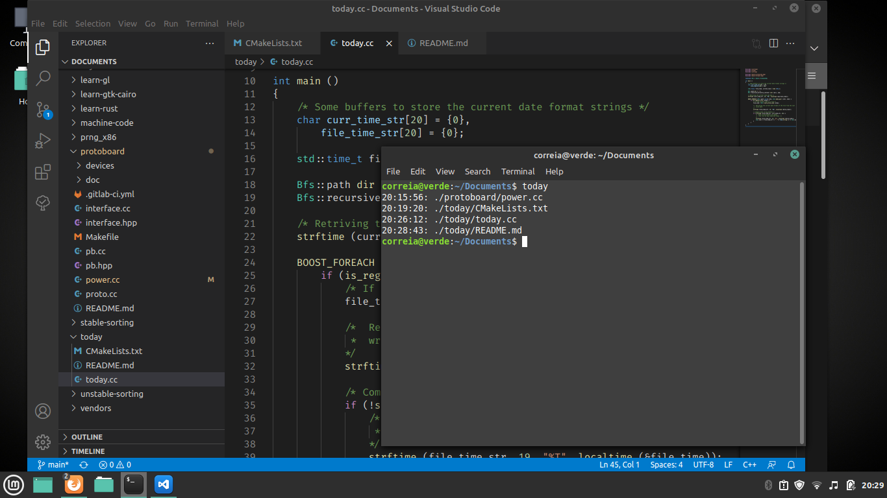

# today

A really simple program to display all modified files in today



## How to Build

### Dependencies

- C++ Boost library (filesystem component)

Just open a terminal and type

```bash
mkdir build
cd build
cmake ..
make
```

## How to install

Open the build directory and type

```bash
sudo make install
```
